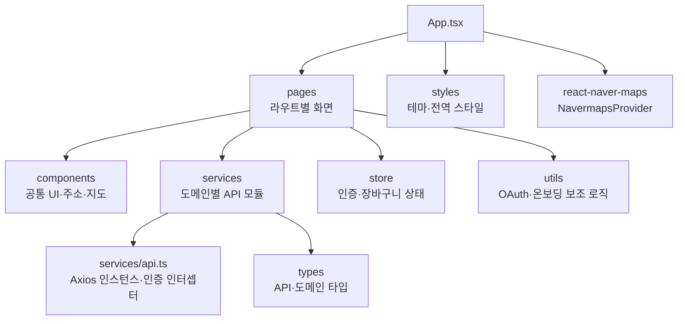

# 알뜰식탁 (SmartMealTable) Frontend

알뜰식탁은 대학생과 1인 가구를 위한 개인 맞춤형 식비 예산 관리 및 혜택 기반 메뉴·가게 추천 PWA 웹 서비스입니다. 이 저장소는 해당 서비스의 프론트엔드 애플리케이션을 담고 있습니다.

사용자는 온보딩에서 프로필, 주소, 예산, 음식 취향, 약관 동의를 설정할 수 있으며, 이후 예산·지출·추천·장바구니·즐겨찾기 기능을 이용할 수 있습니다.

## 링크

- [서비스](https://smartmealtable.netlify.app)
- [회원가입 프로세스 시연](https://drive.google.com/file/d/1sTLYnne4dDMCAZ8pLzUhc__oUtmpEb-D/view?usp=drive_link)
- [전체 기능 시연](https://drive.google.com/file/d/17b0PxYFIEindIAHc7txl80GP7VTkQl-W/view?usp=drive_link)

## 주요 기능

- 이메일과 Google·Kakao OAuth를 통한 인증, 인증 후 온보딩 흐름
- 월간·일간 예산 조회 및 수정, 지출 내역의 등록·조회·수정·삭제와 일별 통계
- 조건에 따른 메뉴·가게 추천, 가게 및 메뉴 상세 화면
- 장바구니 항목 관리와 장바구니 기반 지출 등록
- 주소 관리와 네이버 지도·Geocoder를 활용한 주소 선택
- 프로필·음식 취향·소속 정보와 즐겨찾기 관리

## 기술 구성

| 구분 | 사용 기술 |
| --- | --- |
| UI | React 19, TypeScript, Styled Components, React Icons |
| 빌드 | Vite 6 |
| 라우팅 | React Router 7 |
| 상태 관리 | Zustand |
| API 통신 | Axios |
| 지도 | React Naver Maps |
| 시각화 | Recharts |
| PWA | vite-plugin-pwa |
| 배포 설정 | Netlify |

## 프로젝트 구조

## 라우팅과 접근 제어

`src/App.tsx`에서 브라우저 라우터를 구성합니다. 인증이 필요한 화면은 `ProtectedRoute`로 감싸며, 인증되지 않은 사용자는 로그인 선택 화면으로 이동합니다. 온보딩이 완료되지 않은 사용자는 온보딩 프로필 화면으로 안내됩니다.

## API 통신

`src/services/api.ts`는 Axios 인스턴스를 제공합니다. 요청 시 로컬 스토리지의 액세스 토큰을 `Authorization` 헤더에 추가하고, 401 응답에서는 리프레시 토큰으로 토큰 갱신을 시도합니다. API 기본 주소는 `VITE_API_BASE_URL` 환경 변수로 설정하며, 개발 환경에서 이 값이 없으면 `http://localhost:8080`을 사용합니다. Netlify 배포 설정에서는 `/api/*` 요청을 백엔드 주소로 전달합니다.

도메인별 요청 형식과 응답은 [API_SPECIFICATION.md](./API_SPECIFICATION.md)에서 확인할 수 있습니다.

## PWA와 배포

Vite PWA 플러그인으로 서비스 워커와 웹 앱 매니페스트를 구성합니다. 아이콘은 `public/` 디렉터리에 두며, PWA 설정은 `vite.config.ts`에 있습니다. Netlify 배포 시에는 `netlify.toml`에서 `npm run build`로 빌드한 `dist` 디렉터리를 배포하도록 설정되어 있습니다.
