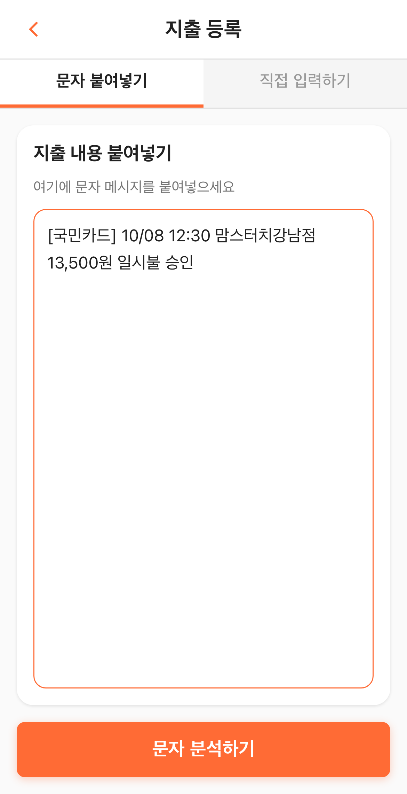
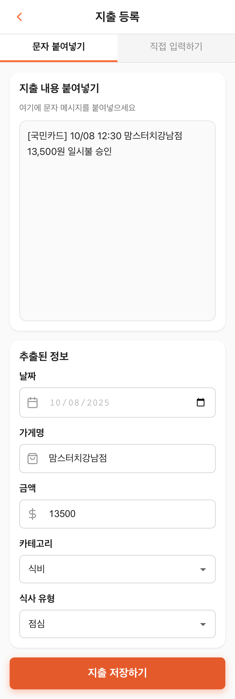
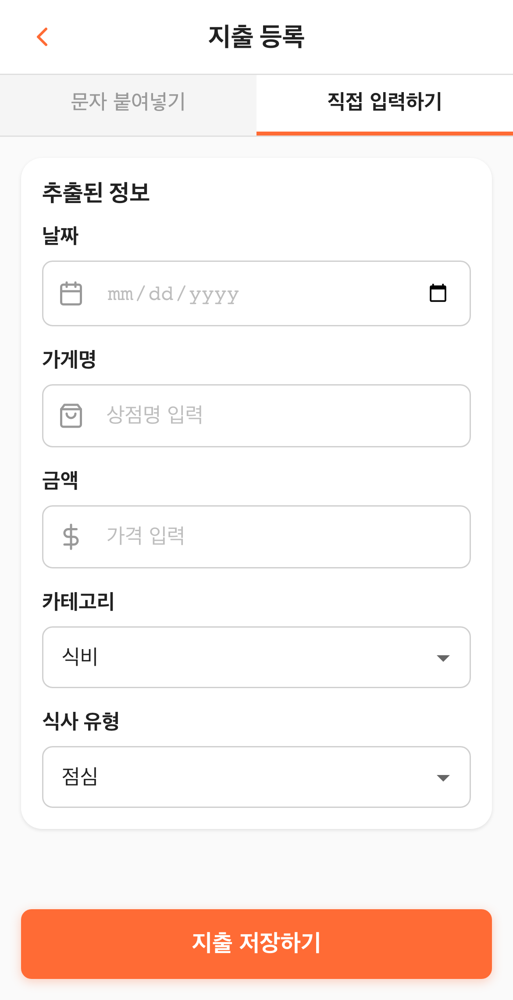
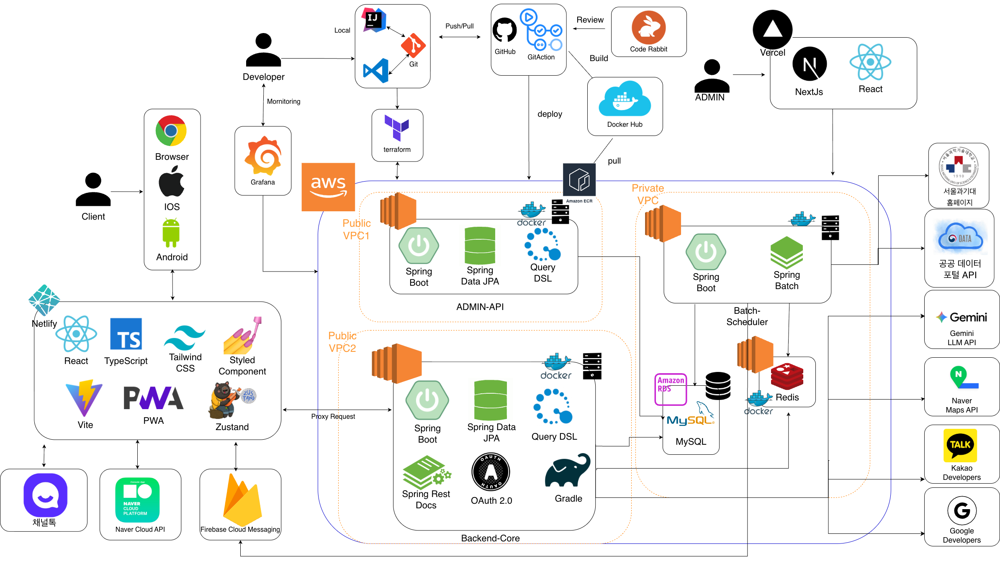
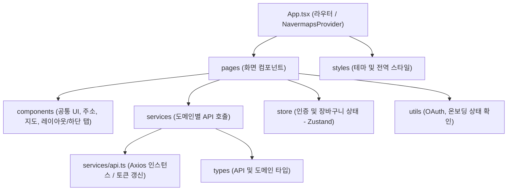

# 알뜰식탁 (SmartMealTable) - Frontend

대학생과 1인 가구가 정해 둔 식비 예산 안에서 끼니를 고를 수 있게 돕는 PWA 웹 서비스입니다. 오늘 남은 식비를 보여 주고, 등록한 주소 주변의 가게와 메뉴를 추천합니다. 이 저장소에는 프론트엔드 코드가 들어 있습니다.

> 2025학년도 2학기 서울과학기술대학교 컴퓨터공학과 캡스톤디자인(졸업작품) 경진대회 최우수상(1위) 수상작입니다.

---

## 링크

- 서비스 배포: https://smartmealtable.netlify.app
  - 백엔드 서버가 종료되어 지금은 로그인할 수 없습니다. 아래 시연 영상을 참고해 주세요.
- 전체 기능 시연 영상: [Google Drive 링크](https://drive.google.com/file/d/17b0PxYFIEindIAHc7txl80GP7VTkQl-W/view?usp=drive_link)
- 회원가입 및 온보딩 시연 영상: [Google Drive 링크](https://drive.google.com/file/d/1sTLYnne4dDMCAZ8pLzUhc__oUtmpEb-D/view?usp=drive_link)

---

## 기획 배경

대학생 용돈 지출 항목 1위는 식비입니다(77.6%, 1인 가구 대학생은 80.4% · 잡코리아 설문, 2024). 외식 물가까지 오르면서 식비 예산을 세우는 학생은 많지만, 끼니마다 금액을 가계부에 옮겨 적는 일이 번거로워 기록을 이어 가기가 어렵습니다.

그래서 카드 결제 문자를 붙여넣으면 가게명과 금액, 날짜가 입력칸에 채워지도록 했고, 남은 예산과 등록한 주소를 기준으로 주변 가게와 메뉴를 추천하도록 만들었습니다. 식당으로 이동하는 중에도 휴대폰으로 확인할 수 있도록 앱 스토어 설치 없이 브라우저에서 쓰는 PWA로 개발했습니다.

---

## 주요 기능 및 화면

### 1. 홈 대시보드 & 예산 관리

홈 화면 위쪽에는 오늘 쓴 금액과 오늘 예산에서 남은 금액이, 아래쪽에는 추천 메뉴가 나옵니다.

<p align="center">
  
  &nbsp;&nbsp;&nbsp;&nbsp;
  
</p>

- **오늘 예산 게이지**: 오늘 쓴 금액이 일일 예산의 80%를 넘으면 게이지가 주황색으로, 100%를 넘으면 빨간색으로 바뀌고 남은 식비도 빨간 마이너스 금액으로 표시됩니다.
- **추천 메뉴 카드**: 추천 서버가 골라 준 메뉴를 카드로 보여 주며, 서버가 붙여 준 `예산적합`, `신제품` 태그를 함께 표시합니다.
- **월간 예산과 달력**: 예산 설정 화면에서 이번 달 목표 예산(예: 600,000원) 대비 지출액과 사용률, 남은 일수를 보여 줍니다. 달력의 날짜 밑에는 그날 예산보다 더 쓴 금액(+)이나 덜 쓴 금액(-)이 `k` 단위로 표시됩니다.

---

### 2. 소비 성향 & 위치 기반 가게 추천

가게 추천은 등록한 주소를 중심으로 반경 안의 가게를 찾고, 사용자가 고른 소비 성향과 싫어하는 음식 설정을 함께 반영합니다.

<p align="center">
  
  &nbsp;&nbsp;&nbsp;&nbsp;
  
</p>

- **소비 성향**: 프로필에서 예산 준수를 우선하는 `절약형`, 새로운 메뉴를 찾는 `모험형`, 둘을 절충한 `균형형` 중 하나를 고르면 추천 기준이 달라집니다.
- **주소와 지도**: 추천은 등록해 둔 주소(집, 학교 등)를 기준으로 합니다. 주소를 등록할 때 네이버 지도에서 현재 위치로 이동하거나 핀을 옮기면 Geocoder가 좌표를 주소로 바꿔 줍니다.
- **필터**: 반경(0.5·1·2·5·10km), 추천순/거리순 정렬, 영업 중인 가게만 보기, 싫어하는 음식 제외를 조합할 수 있습니다.

---

### 3. 결제 문자(SMS)로 지출 등록

카드 승인 문자를 붙여넣으면 서버가 Gemini API로 가게명·금액·날짜·시간을 뽑아 입력칸에 채워 줍니다. 금액과 가게명을 매번 손으로 치지 않아도 됩니다.

<table align="center">
  <tr>
    <td align="center" width="33%"></td>
    <td align="center" width="33%"></td>
    <td align="center" width="33%"></td>
  </tr>
  <tr>
    <td align="center"><b>1. 문자 붙여넣기</b></td>
    <td align="center"><b>2. 추출 값 확인 및 수정</b></td>
    <td align="center"><b>3. 직접 입력 (대체)</b></td>
  </tr>
  <tr>
    <td valign="top">카드 승인 문자 원문을 붙여넣고 '문자 분석하기'를 누릅니다.</td>
    <td valign="top">추출한 값이 입력칸에 채워지고, 분석한 원문은 수정할 수 없게 잠깁니다. 틀린 값만 고쳐서 저장합니다.</td>
    <td valign="top">형식을 인식하지 못한 문자는 '직접 입력하기' 탭에서 손으로 등록합니다.</td>
  </tr>
</table>

- **저장 전 확인**: AI가 뽑은 값은 틀릴 수 있어서 곧바로 저장하지 않습니다. 입력칸에 채워 둔 값을 사용자가 확인하고 '지출 저장하기'를 눌러야 저장됩니다.
- **기록 구분**: 문자로 등록한 지출은 메모에 `SMS 파싱`이 남아서 직접 입력한 지출과 구분됩니다.

---

## 시스템 구조

<p align="center">
  
</p>

프론트엔드는 React 19와 TypeScript로 만든 PWA이고 Netlify에 배포했습니다. 브라우저의 `/api/*` 요청은 Netlify가 AWS EC2의 Spring Boot 서버로 프록시합니다. 백엔드는 Spring Boot, MySQL, Redis(캐싱과 캐시 pre-warm)로 구성되어 있고, 위치 기반 추천에는 네이버 지도 API를, 결제 문자 분석에는 Gemini API를 사용합니다.

---

## 기술 스택

| 분류 | 기술 |
| --- | --- |
| 프론트엔드 코어 | React 19, TypeScript, Vite 6 |
| 라우팅 | React Router 7 |
| 상태 관리 | Zustand (인증, 장바구니) |
| HTTP 통신 | Axios |
| 스타일링 | styled-components |
| 지도 / 위치 | react-naver-maps, Naver Maps Geocoder |
| 차트 / 아이콘 | Recharts (지출 내역 화면의 일별 예산·지출 그래프), React Icons |
| PWA & 배포 | vite-plugin-pwa, Netlify |
| 백엔드 & AI (연동) | Spring Boot, Redis, MySQL, Google Gemini API |

---

## 프론트엔드 프로젝트 구조



---

## 주요 구현 내용

### 1. 라우팅과 접근 제어
- `src/App.tsx`에서 라우트를 정의합니다. 로그인이 필요한 화면은 `ProtectedRoute`로 감싸서, 로그인하지 않은 사용자는 `/login-options`로 보냅니다.
- 온보딩(프로필 → 주소 → 목표 예산 → 음식 카테고리 → 음식 취향 → 약관 동의)을 마치지 않은 사용자는 홈 대신 `/onboarding/profile`로 이동합니다.

### 2. API 통신과 토큰 재발급
- `src/services/api.ts`의 Axios 인스턴스가 모든 요청에 로컬 스토리지의 액세스 토큰을 `Authorization: Bearer` 헤더로 붙입니다.
- 응답이 `401`이면 리프레시 토큰으로 새 액세스 토큰을 받아 실패했던 요청을 한 번 다시 보냅니다. 재발급까지 실패하면 저장된 토큰을 지우고 로그인 화면으로 이동합니다.

### 3. 장바구니와 예산 미리보기
- 장바구니에는 한 가게의 메뉴만 담깁니다. 다른 가게 메뉴를 담으면 서버가 `409`를 돌려주고, 사용자가 확인하면 기존 장바구니를 비운 뒤 새로 담습니다.
- 끼니(아침·점심·저녁·간식·기타)와 결제 일시를 고르면 그날 남은 일일 예산과 끼니 예산을 불러와, 담은 메뉴 합계를 뺀 구매 후 잔액을 보여 줍니다. 잔액이 마이너스가 되면 빨간색으로 표시됩니다.
- 금액을 확인한 뒤 장바구니에서 곧장 지출로 등록할 수 있습니다.

### 4. PWA 설정
- `vite.config.ts`에서 `vite-plugin-pwa`로 서비스 워커와 웹 앱 매니페스트(전체 화면 모드, 세로 고정)를 설정했습니다.
- 모바일 브라우저에서 '홈 화면에 추가'를 하면 앱 스토어 설치 없이 전체 화면 앱처럼 실행됩니다.

---

## 시작하기

```bash
git clone https://github.com/Picance/SmartMealTable-Front.git
cd SmartMealTable-Front
npm install
npm run dev
```
